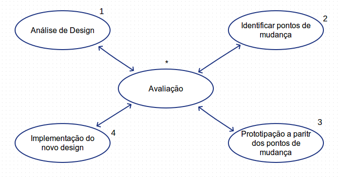

# Meu modelo de processo de design
Modelo de processo de design criado para aula da cadeira de IHC

Modelo:
---
* __Análise de Design__

  * Levar em consideração o estado inicial do design e começar a fazer toda a análise necessária.

* __Identificar pontos de mudança__

  * A partir da informações da “Análise de Design”, levantar os pontos ou requisitos considerados necessários para a melhoria do design.

* __Prototipação a partir dos pontos de mudança__

  * Esboçar um novo design baseado nos requisitos levantados na etapa de “Identificar pontos de mudança”.

* __Implementação do novo design__

  * Construir na nova interface.

* __Avaliação__

  * Atividade principal que é executada após cada a etapa.

  * Verificar se as etapas estão sendo executadas de forma correta e se os artefatos gerados são plausíveis.

Fluxo:
---

